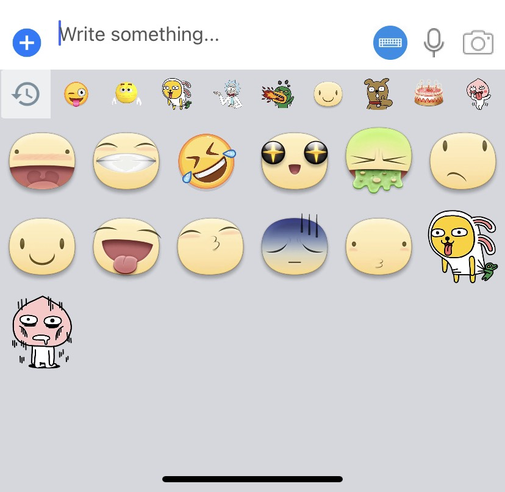

# SGEmojiKeyboard
==================

An alternate keyboard for iOS that lets you display all the emojis supported by iOS. This package base from ayushgoel/AGEmojiKeyboard

Additions that need to be done:

1. Stickers
2. Custom emojis (different font)


## Example Project

To run the example project:

1. Clone the repo to a local folder.
2. Run `pod install` from the directory.
3. Open `SGEmojiKeyboardSample.xcworkspace` placed in folder.
4. Run.

## Usage

1. Use your own `ViewController` (optionally) to conform to [SGEmojiKeyboardViewDataSource][SGEmojiKeyboardViewDataSource] 
and [SGEmojiKeyboardViewDelegate][SGEmojiKeyboardViewDelegate] protocol.
2. Create an instance of [SGEmojiKeyboardView][SGEmojiKeyboardView] and set it as your `textView`'s `inputView`.

```objective-c
  CGRect keyboardRect = CGRectMake(0, 0, self.view.frame.size.width, 216);
  SGEmojiKeyboardView *emojiKeyboardView = [[SGEmojiKeyboardView alloc] initWithFrame:keyboardRect
                                                                           dataSource:self];
  emojiKeyboardView.autoresizingMask = UIViewAutoresizingFlexibleHeight;
  emojiKeyboardView.delegate = self;
  self.textView.inputView = emojiKeyboardView;
```

## Author

ERIC B, bthiep148@gmail.com

## License

SGEmojiKeyboard is available under the MIT license
